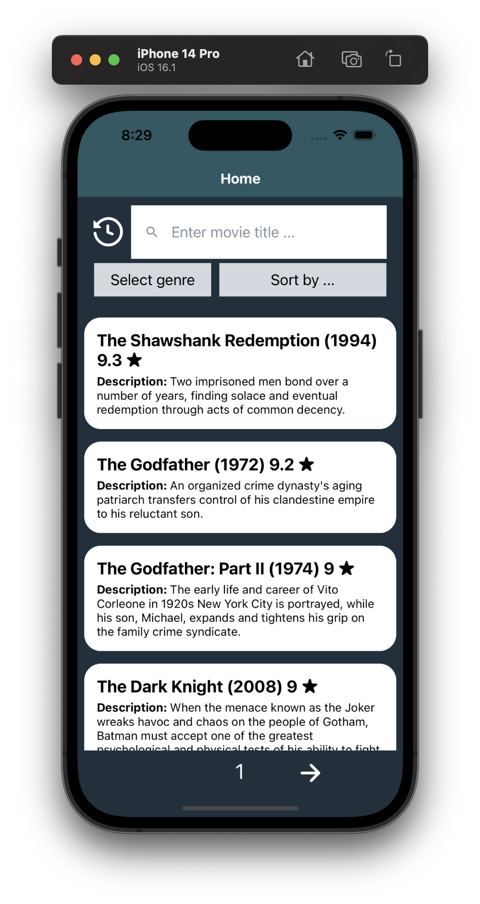
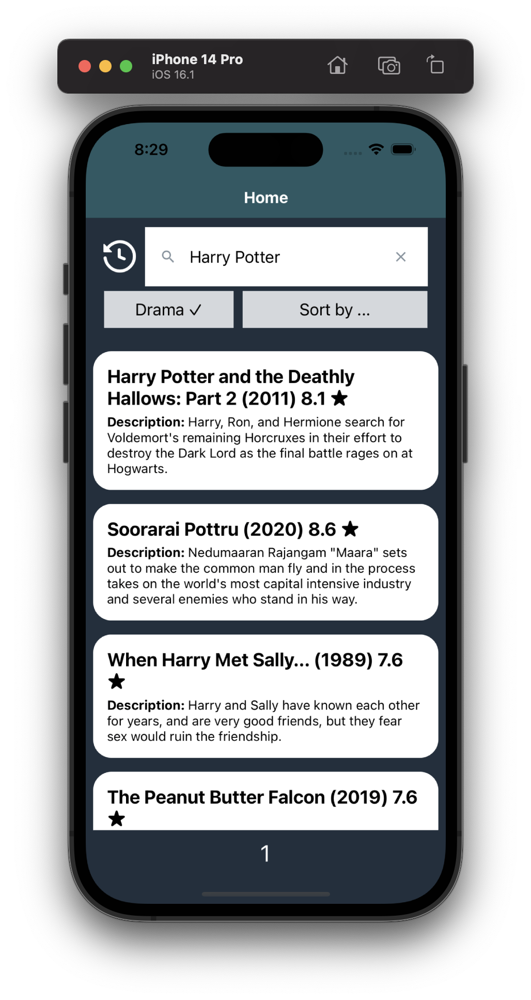
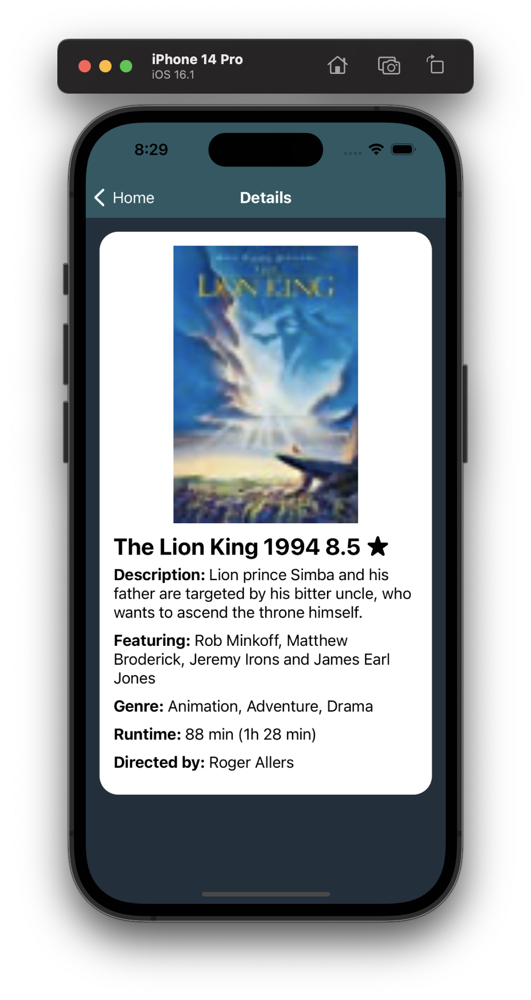
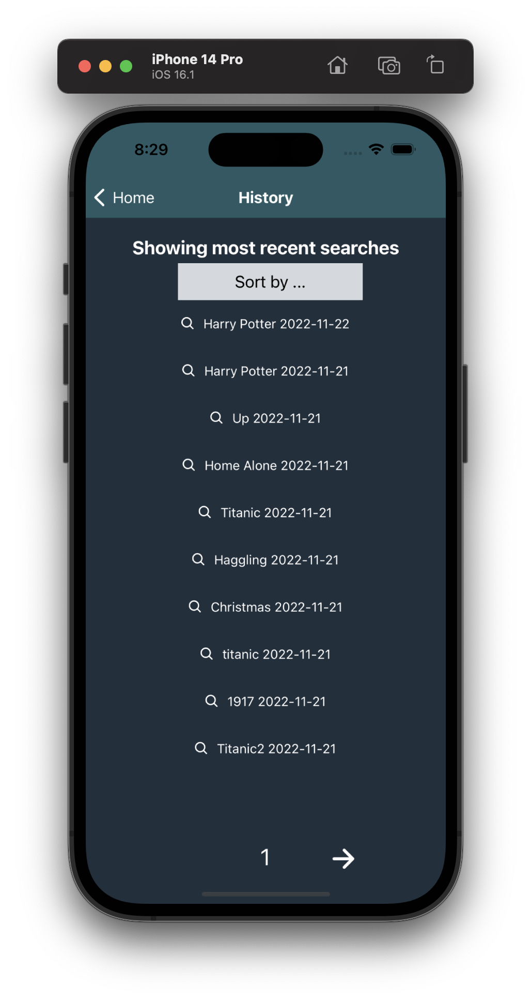

## Hvordan Kjøre Prosjektet
- Installer og sett opp enten iOS simulator (via Xcode) eller Android simulator (via Android Studio). 
- Klon prosjektet fra: https://gitlab.stud.idi.ntnu.no/it2810-h22/Team-3/project4.git 
- Naviger til ~/project4/MovieSearchNative/ i terminal
- Kjør kommando `npm i` i terminal
- Kjør kommando `npm start` i terminal
- Trykk `i` for iOS simulator eller `a` for Android simulator i terminalen

## Dokumentasjon

### React Native
Vi brukte React Native for å gjenskape funksjonaliteten til prosjekt 3 slik at vi har en mobilapplikasjon versjon av prosjekt 3, samt noen utvidelser. Vi brukte Expo sammen med React Native for å unngå å skrive “duplikat-kode”. Expo tillater utvikleren å skrive koden til applikasjonen et sted i prosjektet, fremfor å måtte skrive en versjon for hver mobilplattform (dermed “duplikat-kode”). Expo oversetter altså koden til komponenten til riktig versjon basert på operativsystemet som brukeren kjører applikasjonen i.

### Backend
Har gjort ingen endringer til backend for applikasjonen utenom å få overført porten slik at man kan koble til databasen uten å være på NTNU sitt nett.

### Bruk av komponenter
Vi innså at i prosjekt 3 hadde vi brukt App.tsx noe feil, som sørget for at vi hadde mange unødvendige rerenderinger av komponentene våres. I prosjekt 3 hadde vi en fil kalt MovieSearch.tsx der alle komponentene på appen var plassert i returnen til MovieSearch. Dersom MovieSearch rerendret, sørget vårt gamle oppsett at alle andre komponenter også rerendret. Det betyr at mange av komponentene ble rerendret selv om de ikke endret state. Nå er komponentene mer uavhengig av hverandre, noe som sørger for færre rerendringer.

### Simulering av bruker
Applikasjonen simulerer at brukeren er alltid logget inn, slik at det ikke var nødvendig for de som skulle vurdere oss å lage en ny bruker for å se applikasjonen. 

Vi lagrer søkene brukeren gjør i en egen logg. Her kan brukeren se de siste søkene kronologisk, og når man klikker på et søk, så gjøres søket på nytt igjen. 

### Søkefunksjonalitet
Søkefunksjonaliteten er lik som i prosjekt 3, slik at bruker kan søke med full-tekst søk (vha. Apache Lucene og Cypher) og sjanger.

Vi lagrer tittelen bruker søker etter, valgt sjanger og valgt sortering i Apollo sin Local State Management. Slik kan vi bruke disse variablene i hele appen, og slippe å sende disse videre som props.

Vi har lagt til mulighet for å sortere søkehistorikk etter dato, slik at bruker kan se nyeste og eldste søk enkelt. Vi valgte å ikke legge til filtrering for søkehistorikk da vi opplevde det ikke som hensiktsmessig å eventuelt filtrere etter dato. Man kan ennå filtrere filmsøk etter sjanger og sortere etter IMDB Rating (men er alltid sortert etter relevans hvis et søk er gjort med full-tekst søk). 

### Styling
For å sikre ryddighet i koden vår har vi hatt en egen “styles” mappe for styling. Alle disse filene i denne mappen er “ts” filer og ikke “tsx”, fordi de kun bruker TypeScript og ikke tsx.

Vi valgte å bruke samme fargene i appen som på nettsiden, for å skape kontinuitet mellom plattformene. Fargene viser et mørkt tema slik som på nettsiden. Vi valgte mørkt tema på nettsiden i henhold til bærekraftig design. 

### Utformingsvalg
Vi valgte å bruke et standard historikk-ikon til å linke til historikksiden, fremfor å bruke ikon og tekst sammen. Vi brukte også standard pil-ikoner til å linke til forrige og neste side av listen med filmer hentet fra databasen. Dette er fordi mobilskjermen har begrenset plass, som gjør det mer brukervennlig å bruke ikoner fremfor tekst. For filtrering og sortering valgte vi å kun vise tekst som sier kategorien som er valgt (for eksempel “drama” framfor “kategori: drama”), og hvilken rekkefølge listen er sortert etter (for eksempel “ASC” framfor “sortert etter: ASC”). Dette gjorde vi også for å spare plass. Når brukeren laster inn appen sier feltet for kategori “Select genre”, og feltet for sortering sier “Sort by …”. Dette forteller brukeren hva disse feltene er, slik at brukeren skjønner hva feltene er fra starten.

### Detaljert visning av film 
Når en film klikkes på, så blir brukeren navigert til en egen side hvor den aktuelle filmen vises mer detaljert. Her kan brukeren klikke seg tilbake for å se hele listen med filmer som er lastet inn. Fra forrige gang har vi utviklet måten vi laster inn data på. Nå laster vi ikke inn all informasjonen til en film før den klikkes på. Før en film klikkes på har den derfor kun lastet inn dataen som vises til brukeren, og når den filmen blir klikket på gjøres det en query etter enda mer info om filmen. 

### Pagination
Vi har lagt til paginering på komponenten for søkehistorikk slik at brukeren kan se alle sine søk. Dette var tidligere ikke mulig som førte til at mange søk ble lagret men var ikke tilgjengelig for brukeren. Vi hadde valget mellom å kunne lagre de siste 10 søkene eller gjøre alle tilgjengelig og da valgte vi at alle søk var tilgjengelig. 

De ulike sidene kunne vise samme film flere ganger. Dette var ikke noe vi klar over da vi leverte, og det viste seg at det var en bug i GraphQL-biblioteket. Dette har vi nå fått fikset.

Dersom man søkte etter en film, og var på f.eks. side 6, så ble ikke brukeren alltid navigert automatisk til første side. Dette kunne føre til at brukeren ikke fikk se de mest relevante filmene først. Nå resettes siden til første side hver gang brukeren enten søker, filtrerer eller sorterer filmer.

Vi prøvde å få implementert at man kan klikke seg til første/siste side. Det går dessverre ikke an å kombinere full-tekst søk med COUNT som ville bety at det ikke ville gå an å sjekke hvor mange søketreff man fikk ved å søke etter tittel. Derfor måtte første og siste side håndteres ved å alltid sjekke om det var på posisjon 0 i data arrayen man mottok fra databasen, eller om det ikke var mer enn limit + 1. Hvis lengden til data arrayen er lik limit betyr det at det ikke finnes flere noder i databasen og man er på siste side. Derfor kan man ikke ha en knapp for å hoppe til første eller siste side. Uten full-tekst søk er det mulig å telle antall treff med "COUNT" i GraphQL og dele tallet på limit og til slutt runde opp. 

### Testing
Gruppen har valgt å gjennomføre grundig exploratory testing for å teste applikasjonen. Vi prøvde alle funksjonene i applikasjonen i rollen som bruker for å finne åpenbare feil i programvaren. Det ble ikke implementert komponenttesting og end-to-end-testing i dette prosjektet, grunnet kort tidsfrist til innlevering. Vi fokuserte heller på å gjøre grundig arbeid i resten av applikasjonen.

For å sikre brukervennligheten i applikasjonen utførte vi brukertester på bekjente. Ut ifra dette gjorde vi endringer i searchbaren vår. En endring var å flytte søk-ikonet inn i selve searchbaren istedenfor å ha det utenfor som vi hadde før. Vi vurderte også å legge til automatisk søk, altså at det gjøres et søk hver gang brukeren taster inn en bokstav. Etter litt diskusjon kom vi fram til at dette ikke ville være smart, da man ville få altfor mye data i search history.

En annen endring var at vi implementerte at man resetter søket dersom man trykker på kryssknappen i searchbaren. Dette gjorde vi fordi flere brukere slet med å finne tilbake til alle filmene dersom de hadde gjennomført et søk.

### Gitlab
Vi har brukt Gitlab og Git i utviklingen av appen vår. Hver commit-melding starter med en “#” som viser hvilket issue/branch commiten er koblet til. Vi har hatt fokus på å lage gode og beskrivende issues slik at alle gruppemedlemmene enkelt kan se hvilke arbeidsoppgaver som må gjøres.

### Bilder av appen

